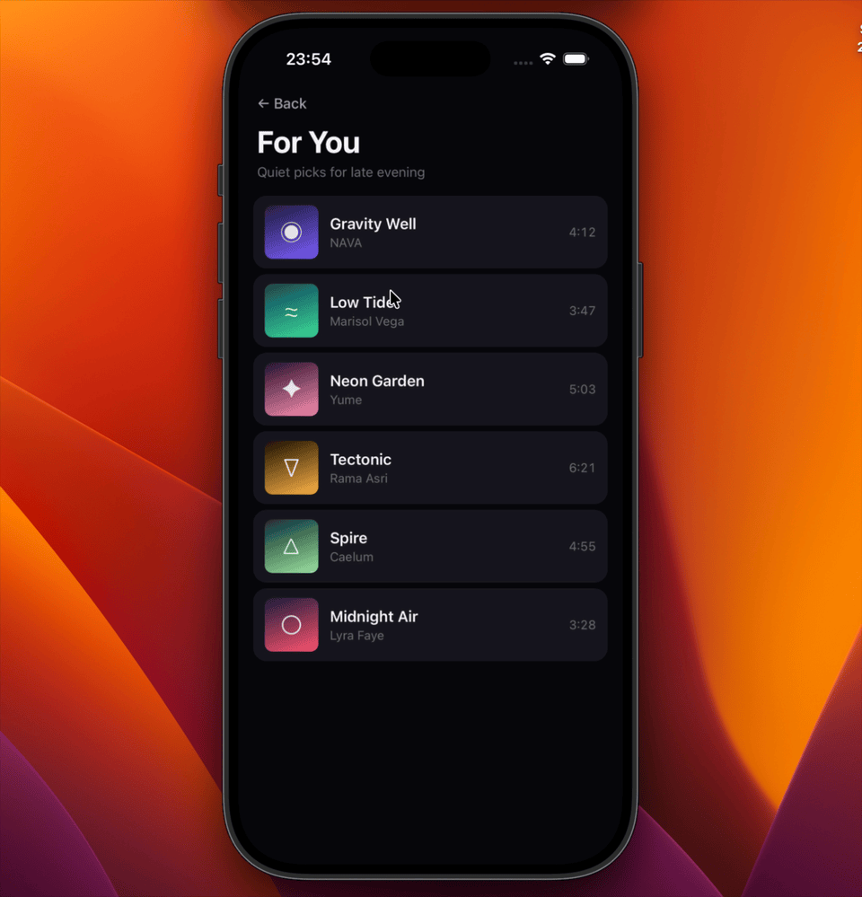
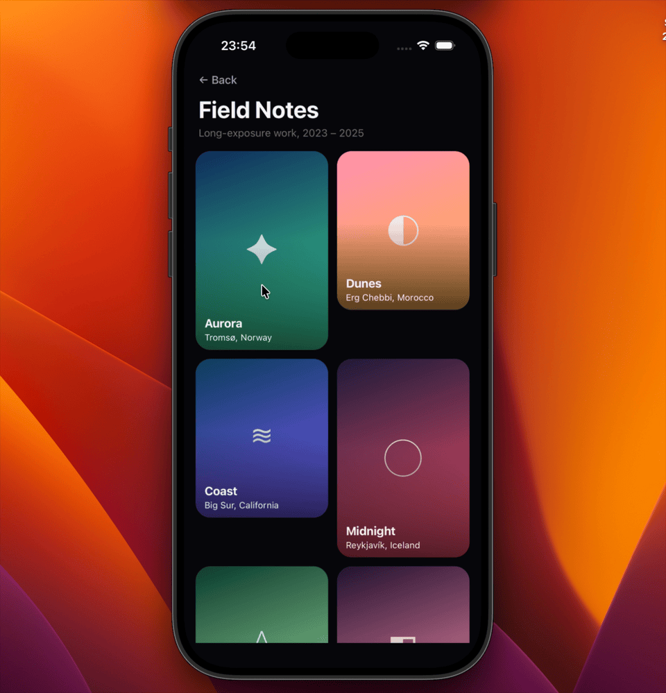

# react-native-screen-choreography

Choreographed shared element transitions for React Native with multi-element coordination, progress-driven companion motion, and a native overlay host above the navigation stack.

> **Status:** pre-1.0. The public API is converging but minor versions can still introduce breaking changes. See [CHANGELOG.md](CHANGELOG.md).


<p align="center">
  
  &nbsp;
  
  &nbsp;
  
</p>

## Overview

This library is built for apps that want more than a single shared element moving between two screens. It coordinates a whole transition session: containers, icons, labels, backdrop dim, progressive content reveal, and interruption handling.

What it provides:

- multi-element shared transitions driven by one progress value
- companion motion hooks for backdrop, reveal timing, and staggered sections
- a native overlay host above native-stack containers for reliable presentation ownership
- safer forward, reverse, and interruption handling than a plain screen animation

## Requirements

- React Native **>= 0.76** with the New Architecture (Fabric) enabled
- React **>= 18**
- `@react-navigation/native` and `@react-navigation/native-stack` **>= 6** (validated on 7.x)
- `react-native-reanimated` **>= 4**
- `react-native-screens` **>= 4**
- `react-native-worklets` **>= 0.8**

The example app in this repository is validated on React Native 0.83, React 19, and Reanimated 4.

## Installation

Install the library and its required peers:

```bash
npm install react-native-screen-choreography
npm install react-native-reanimated react-native-worklets @react-navigation/native @react-navigation/native-stack react-native-screens
```

Or with Yarn:

```bash
yarn add react-native-screen-choreography
yarn add react-native-reanimated react-native-worklets @react-navigation/native @react-navigation/native-stack react-native-screens
```

Your Babel setup must include `react-native-worklets/plugin`. The library relies on UI-thread worklets for measurement, scheduling, and transition coordination; without this plugin the runtime will fail when those worklets execute. The example in this repo uses:

```js
plugins: ['react-native-worklets/plugin']
```

For iOS, install pods after adding the dependency:

```bash
cd ios && pod install
```

## Recommended Navigator Setup

The current implementation works best with these native-stack settings:

- `animation: 'none'`
- transparent detail presentation
- transparent detail `contentStyle`

That configuration lets the overlay own the visible transition instead of competing with a screen-level navigator animation.

```tsx
import React from 'react';
import { NavigationContainer } from '@react-navigation/native';
import { createNativeStackNavigator } from '@react-navigation/native-stack';
import { ChoreographyProvider } from 'react-native-screen-choreography';

const Stack = createNativeStackNavigator();

export function App() {
  return (
    <ChoreographyProvider debug={false}>
      <NavigationContainer>
        <Stack.Navigator
          screenOptions={{
            headerShown: false,
            animation: 'none',
          }}
        >
          <Stack.Screen name="TokenList" component={TokenListScreen} />
          <Stack.Screen
            name="TokenDetail"
            component={TokenDetailScreen}
            options={{
              presentation: 'containedTransparentModal',
              contentStyle: { backgroundColor: 'transparent' },
            }}
          />
        </Stack.Navigator>
      </NavigationContainer>
    </ChoreographyProvider>
  );
}
```

## Debugging

`ChoreographyProvider` accepts a structured `debug` prop:

```tsx
// off (default)
<ChoreographyProvider debug={false}>

// info / warn / error logs (shortcut)
<ChoreographyProvider debug={true}>

// full structured form
<ChoreographyProvider
  debug={{
    level: 'trace',     // 'error' | 'warn' | 'info' | 'trace'
    logEveryFrame: false, // disable coalescing of repeated lines
  }}
>
```

At `info` you get one line per major lifecycle event (transition start, active, complete, cancel). At `trace` you also get measurement and readiness traces. Identical consecutive log lines are coalesced as `... (×N)` unless you set `logEveryFrame: true`.

You can also drive the logger imperatively from anywhere via the exported helpers `setDebugEnabled`, `setDebugLevel`, `setDebugCoalesce`, `isDebugEnabled`, `isTraceEnabled`, `getDebugLogs`, and `clearDebugLogs`.

## Transition Lifecycle

A forward transition runs through a fixed sequence. Understanding this order is enough to debug almost any visible issue.

```
tap → preMeasure source → set pendingTarget → navigation.navigate
     → target screen mounts → SharedElements register on target
     → coordinator waits for stable target measurements
     → freeze source/target snapshots onto each pair
     → updateSession({ state: 'active' })
          ↓
     overlay <Layout> commits + native host presents
          ↓
     handleOverlayReady(sessionId) → syncHiddenElements()
          ↓
     reals are hidden the same frame the overlay first paints
          ↓
     waitForOverlayReady resolves → clear pendingTarget
          ↓
     progress: 0 → 1 (spring/timing)
          ↓
     onFinish → completeTransition → state 'completing'
          ↓
     hiddenElements.clear() → updateSession(null)
          ↓
     reals reveal, overlay unmounts on same commit
```

Key invariants the runtime guarantees:

- **Registration is stable.** `SharedElement` registers exactly once per `(id, groupId, screenId)` and does not re-register when `children`, `transition`, or `style` change. The coordinator calls `getSnapshot()` once at session start to capture a frozen view.
- **Snapshots are frozen.** Once a session is `active`, the overlay never reads live `SharedElement` props. Re-renders, focus changes, or list-row recycling on the source side cannot affect the in-flight overlay.
- **Hide handoff is overlay-paint-driven.** Real elements are not hidden when the session activates; they are hidden in the same frame the overlay's `useLayoutEffect` (and the native host's presentation ack) fire. This eliminates the start-of-animation blank flash.
- **Reveal is progress-driven.** The destination screen reveals at `progress.value > 0.001` on the UI thread; reals stay individually hidden via per-element `SharedValue<number>` flags until the session is cleared.

## Troubleshooting

| Symptom | Likely cause | Fix |
| --- | --- | --- |
| Blank flash at the start of the animation | Overlay host not committed before reals were hidden | Make sure `ChoreographyProvider` is mounted above `NavigationContainer` and the provider is not unmounting between routes |
| Source card double-renders during animation | Stack `animation` is not `'none'`, so the navigator is animating the route under the overlay | Set `screenOptions={{ animation: 'none' }}` |
| Detail screen shows opaque background behind the morphing card | Detail route is not transparent | Use `presentation: 'containedTransparentModal'` and `contentStyle: { backgroundColor: 'transparent' }` |
| `Coordinator: No valid pairs found` warning | Target `SharedElement` never registered or measured to zero size | Make sure the target screen is wrapped in `ChoreographyScreen` and the element is not inside a virtualized off-screen cell |
| Animation runs but elements snap at the end | Per-frame style mutation on container shadows | Use `boxShadow` (RN 0.76+) and animate `opacity` instead of `shadowColor`/`elevation`/`shadowRadius` per frame |
| `[Registry] duplicate id` warning | Same `id` registered on the same screen with conflicting `groupId`s | Make `id` unique per `(id, screenId)` and use a single `groupId` per element across screens |
| Reverse transition jumps on Android | Live re-measurement of the source row was needed but the row was off-screen | Keep the source row mounted and visible (avoid scrolling away while a detail is open) |
| Logs are very noisy | `debug={true}` enables `info` level | Use `debug={false}`, or `debug={{ level: 'warn' }}` for production-style output |

## Quick Start

### 1. Wrap each screen root

`ChoreographyScreen` gives the library a stable screen identity for registration, readiness, and visibility handoff.

```tsx
import { ChoreographyScreen } from 'react-native-screen-choreography';

function TokenListScreen() {
  return (
    <ChoreographyScreen screenId="TokenList">
      {/** screen content */}
    </ChoreographyScreen>
  );
}
```

### 2. Define transitions and mark matching shared elements

Use the same `id` and `groupId` on source and target elements. The `groupId` represents one transition session. The `id` represents one element within that session. Each `SharedElement` also receives an explicit `transition` object that defines how that pair renders in the overlay.

```tsx
import {
  SharedElement,
  StandInContainer,
  StandInCrossfade,
  resolveSurfaceStyle,
  type SharedElementTransition,
} from 'react-native-screen-choreography';

const cardTransition: SharedElementTransition = {
  renderer: function CardTransition({ progress, direction, source, target }) {
    return (
      <StandInContainer
        progress={progress}
        direction={direction}
        sourceMetrics={source.metrics}
        targetMetrics={target.metrics}
        sourceStyle={resolveSurfaceStyle(source.style)}
        targetStyle={resolveSurfaceStyle(target.style)}
      />
    );
  },
  zIndex: 0,
};

const textTransition: SharedElementTransition = {
  renderer: function TextTransition({
    progress,
    direction,
    source,
    target,
    zIndex,
  }) {
    return (
      <StandInCrossfade
        progress={progress}
        direction={direction}
        sourceMetrics={source.metrics}
        targetMetrics={target.metrics}
        sourceContent={source.content}
        targetContent={target.content}
        zIndex={zIndex}
      />
    );
  },
  zIndex: 2,
};

<SharedElement
  id={`token.${token.id}.card`}
  groupId={`token.${token.id}`}
  transition={cardTransition}
>
  <View style={styles.card}>
    <SharedElement
      id={`token.${token.id}.name`}
      groupId={`token.${token.id}`}
      transition={textTransition}
    >
      <Text>{token.name}</Text>
    </SharedElement>
  </View>
</SharedElement>
```

### 3. Navigate through the choreography hook

`useChoreographyNavigation` pre-measures the source, manages pending target visibility, creates the transition session, and coordinates reverse flows.

```tsx
import { useChoreographyNavigation } from 'react-native-screen-choreography';

function TokenListScreen({ navigation }) {
  const { navigate } = useChoreographyNavigation(navigation);

  return (
    <Pressable
      onPress={() =>
        navigate(
          'TokenDetail',
          { tokenId: token.id },
          {
            transitionConfig: {
              group: `token.${token.id}`,
            },
          }
        )
      }
    >
      <TokenRow token={token} />
    </Pressable>
  );
}
```

### 4. Add companion motion on the detail screen

`useChoreographyProgress` exposes the shared progress value and common derived behaviors such as backdrop dim and early settle handling when the user starts interacting before the transition is fully settled. `useProgressRevealStyle` adds a generic fade-and-lift reveal for any supporting content block.

```tsx
import Animated from 'react-native-reanimated';
import {
  useChoreographyProgress,
  useProgressRevealStyle,
  useLatchedReveal,
  useStaggeredReveal,
} from 'react-native-screen-choreography';

function TokenDetailScreen() {
  const { backdropStyle, settleTransition } = useChoreographyProgress();
  const supportingVisualStyle = useProgressRevealStyle();
  const showSections = useLatchedReveal();
  const { getItemStyle } = useStaggeredReveal(4, { stagger: 0.04 });

  return (
    <ScrollView onScrollBeginDrag={settleTransition}>
      <Animated.View style={[styles.backdrop, backdropStyle]} />
      <Animated.View style={supportingVisualStyle}>
        <SummaryVisual />
      </Animated.View>
      {showSections ? (
        <Animated.View style={getItemStyle(0)}>
          <SectionOne />
        </Animated.View>
      ) : null}
    </ScrollView>
  );
}
```

## Mental Model

- `ChoreographyProvider` owns the registry, transition coordinator, overlay, and active session state.
- `ChoreographyScreen` manages visibility for both roles: the source screen's non-shared content fades out as the forward animation begins, while the destination screen is revealed from the first spring frame with only the shared elements hidden individually (the overlay stand-ins own those positions).
- `SharedElement` tags matching source and target elements.
- `useChoreographyNavigation` starts and reverses sessions.
- `useChoreographyProgress` lets the screen react to the active session.
- `useLatchedReveal` and `useStaggeredReveal` help detail screens reveal content without duplicating transition lifecycle code.

## Public API At A Glance

### Components

| Component | Purpose |
| --- | --- |
| `ChoreographyProvider` | Hosts the registry, coordinator, overlay, and native transition host; accepts `debug`, `onTransitionStart`, and `onTransitionEnd` |
| `ChoreographyScreen` | Provides a stable `screenId` for registration, readiness tracking, and progress-driven visibility orchestration — source screens fade out during forward transitions and destination screens are revealed from the first spring frame with only the shared elements individually hidden |
| `SharedElement` | Registers one shared element by `id`, `groupId`, and `transition`; the transition renderer defines exactly how the overlay animates that pair |

`onTransitionStart(session)` fires when a session becomes active with resolved pairs. `onTransitionEnd(session)` fires after the active session completes or is cancelled, which makes them useful for instrumentation, analytics, or app-level UI coordination.

### Hooks

| Hook | Returns |
| --- | --- |
| `useChoreographyNavigation(navigation)` | `navigate()` and `goBack()` integrated with the transition system |
| `useChoreographyProgress()` | `progress`, `backdropStyle`, `isActive`, `settleTransition()` to snap to the current screen endpoint and complete the session |
| `useProgressRevealStyle(config?)` | Animated style for a generic progress-driven fade-and-lift reveal |
| `useLatchedReveal(config?)` | Boolean gate that opens at a progress threshold and stays visible once revealed |
| `useStaggeredReveal(count, config?)` | `getItemStyle(index)` for staged reveal sections |
| `useChoreography()` | Low-level access to context and the active session |

### Utilities

These are advanced exports rather than the primary app-facing API, but they are part of the public surface today.

| Utility | Purpose |
| --- | --- |
| `measureElement(ref, animatedRef?)` | Measure a single element and normalize screen-space metrics |
| `measureElements(refs, animatedRefs?)` | Measure many elements through the legacy per-element path |
| `measureElementsBatched(entries)` | Batch many measurements through one UI-runtime call; used internally by the coordinator |

### Transition Renderers

`SharedElementTransition` and `SharedElementTransitionRendererProps` are exported from [src/types.ts](src/types.ts). The public contract is intentionally small:

```ts
interface SharedElementTransition {
  renderer: SharedElementTransitionRenderer;
  zIndex?: number;
}
```

The renderer receives:

- `progress` and `direction` for the active session
- `source` and `target` objects with `screenId`, measured bounds, flattened style, and rendered content
- `zIndex` so related transitions can layer predictably

The library ships low-level building blocks such as `StandInContainer`, `StandInElement`, `StandInCrossfade`, and `resolveSurfaceStyle`, but it does not choose stock presets for you anymore. App code owns the visual recipe.

### Core Transition Config

`SharedElementTransition`, `TransitionConfig`, and `ChoreographyNavigationOptions` are exported from [src/types.ts](src/types.ts). The session-matching config still looks like this:

```ts
interface TransitionConfig {
  group: string;
}

interface ChoreographyNavigationOptions {
  transitionConfig?: TransitionConfig;
  spring?: SpringConfig;
  duration?: number;
}
```

For app code, the cleanest pattern is:

- define reusable `SharedElementTransition` objects close to the feature or screen that owns the transition
- declare each element's overlay behavior once at the `SharedElement` site with `transition={...}`
- pass only `transitionConfig.group` during navigation in the common case
- pass `spring` or `duration` as navigation options when you want to override the default transition animation

## Known Limitations

- The best-supported setup is still `@react-navigation/native-stack` with stack animation disabled.
- Interactive gesture progress is not wired yet.
- Transition startup still depends on live target measurement for structural elements.
- Complex shared content is rendered as overlay stand-ins, not native bitmap snapshots.
- The element registry is keyed by `id` (per-screen lookups by `(id, screenId)` work, but two screens cannot register the same `id` with different `groupId`s without a warning).

See [docs/limitations-and-next-steps.md](docs/limitations-and-next-steps.md) for current constraints, workarounds, and roadmap priorities.

## Further Documentation

- [CHANGELOG.md](CHANGELOG.md) for release notes
- [docs/architecture-plan.md](docs/architecture-plan.md) for the runtime architecture and contributor-level internals
- [docs/limitations-and-next-steps.md](docs/limitations-and-next-steps.md) for support boundaries and planned improvements
- [docs/library-comparison.md](docs/library-comparison.md) for a comparison with other shared transition approaches
- [example/README.md](example/README.md) for the example app setup and files to inspect

## Example App

The example app demonstrates a wallet-style token list to detail transition.

```bash
cd example
yarn install
cd ios && pod install && cd ..
yarn ios
# or
yarn android
```

## Contributing

See [CONTRIBUTING.md](CONTRIBUTING.md).

## License

MIT
