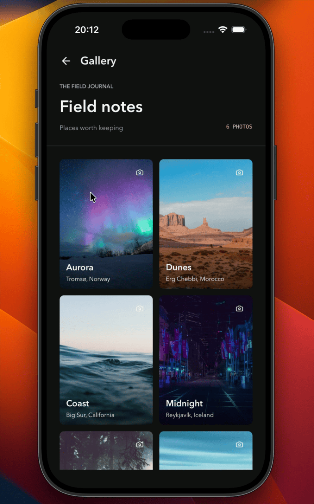
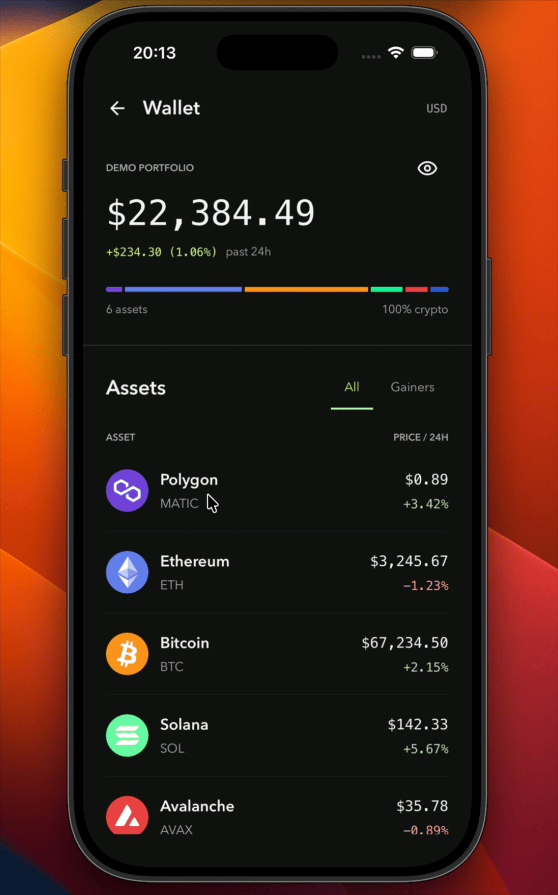
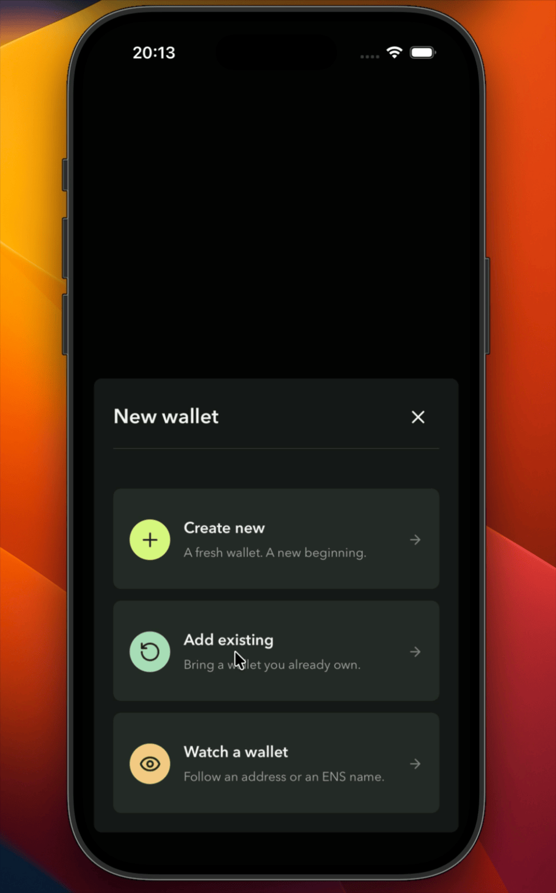

# react-native-screen-choreography

**Shared elements. Connected screens.**

Choreograph shared elements, companion reveals, and custom back gestures with one progress value. Keep real content alive as it moves between React Native screens.

[Read the docs](docs/guide/introduction.md) · [Get started](docs/guide/installation.md) · [API reference](docs/api/components.md) · [Examples](docs/examples.md)

> **Pre-1.0:** the public API is converging, but minor versions can introduce breaking changes.

<p align="center">
  
  &nbsp;
  
  &nbsp;
  
</p>

## One owner. One receiving target.

The source owns a component. The destination declares its bounds. The library moves the same native subtree through an overlay into the destination using `react-native-teleport`; React state and context stay with the original owner.

```tsx
// Source screen: render content once.
<SharedElement id="hero" groupId="photo.aurora" style={styles.tile}>
  <PhotoHero />
</SharedElement>

// Destination screen: an empty, measurable receiving target.
<SharedElement.Target
  id="hero"
  groupId="photo.aurora"
  style={styles.hero}
/>
```

The owner screen must remain mounted. Pair both endpoints with the same element ID and group, wrap routes in `ChoreographyScreen`, and navigate with that group. Follow the [complete two-screen example](docs/guide/quick-start.md) for imports, provider placement, navigator configuration, and Back.

## Installation

```sh
npm install react-native-screen-choreography
```

The library also needs native peer dependencies and a native app rebuild. Follow the [installation guide](docs/guide/installation.md) for your navigation setup before running the example above.

- **Platforms:** iOS and Android, React Native ≥0.76 with the New Architecture / Fabric.
- **Runtime:** React ≥18, Reanimated ≥4, Worklets ≥0.8, Screens ≥4, and Teleport ≥1.2. Choose mutually compatible peer versions; these lower bounds are not a full tested compatibility matrix.
- **Navigation:** React Navigation native-stack ≥6 (validated on 7.x), or Expo Router ≥56.1.1.
- **Expo:** a development build is required. Expo Go does not include the custom native host.

The checked-in examples use React Native 0.83 and Expo SDK 57. Native-stack swipe progress is not connected automatically; use [interactive Back](docs/guide/interactive-back.md) for custom gesture control.

## Documentation

| Start here                                         | Build with motion                                  | Go deeper                                        |
| -------------------------------------------------- | -------------------------------------------------- | ------------------------------------------------ |
| [Introduction](docs/guide/introduction.md)         | [Transition recipes](docs/guide/transitions.md)    | [Component reference](docs/api/components.md)    |
| [Installation](docs/guide/installation.md)         | [Interactive Back](docs/guide/interactive-back.md) | [Navigation reference](docs/api/navigation.md)   |
| [Your first transition](docs/guide/quick-start.md) | [Readiness and loading](docs/guide/readiness.md)   | [Transitions reference](docs/api/transitions.md) |
| [Expo Router](docs/guide/expo-router.md)           | [Troubleshooting](docs/guide/troubleshooting.md)   | [Hooks and utilities](docs/api/hooks.md)         |

Contributor material: [runtime architecture](docs/architecture.md), [performance measurements](docs/performance.md), and [contributing](CONTRIBUTING.md).

## Example apps

Gallery, Wallet, and Wallet setup share their screen implementations and module-scoped `defineTransition` recipes across both integrations.

- [React Navigation example setup](examples/react-navigation/README.md)
- [Expo Router example setup](examples/expo-router/README.md)
- [Shared example source](examples/shared)

## Work on the documentation

The documentation is a static VitePress site. Most edits are ordinary Markdown; native dependencies are not needed to build it. Node.js 22 or newer is required for the docs toolchain.

```sh
npm ci --prefix docs
npm run dev --prefix docs
npm run build --prefix docs
```

## License

[MIT](LICENSE)
