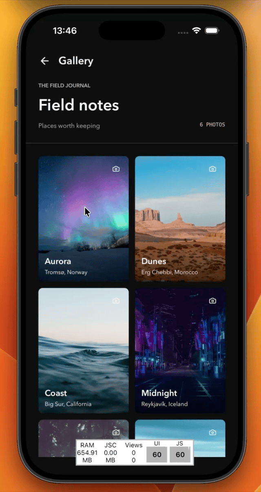
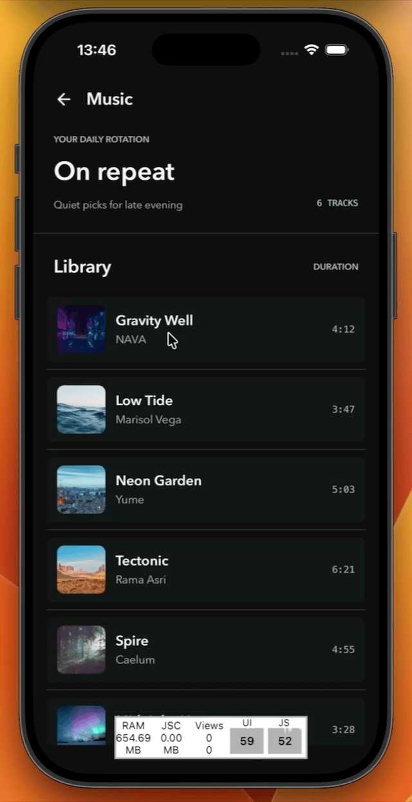
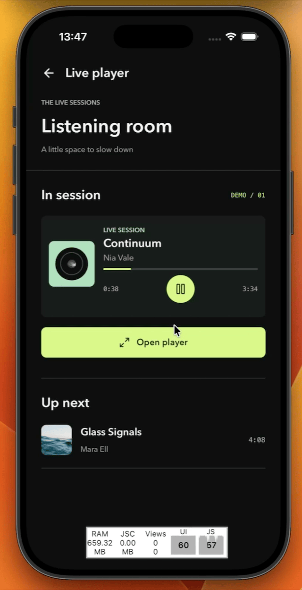

# react-native-screen-choreography

Choreographed shared element transitions for React Native with multi-element coordination.

> **Status:** pre-1.0. The public API is converging but minor versions can still introduce breaking changes.

<p align="center">
  
  &nbsp;
  
  &nbsp;
  
  &nbsp;
  
</p>

## Overview

This library is built for apps that want more than a single shared element moving between two screens. It coordinates a whole transition session: containers, icons, labels, backdrop dim, progressive content reveal, and interruption handling.

What it provides:

- multi-element shared transitions driven by one progress value
- companion motion hooks for backdrop, reveal timing, and staggered sections
- a native overlay host above native-stack containers for reliable presentation ownership
- safer forward, reverse, and interruption handling than a plain screen animation

## Requirements

- React Native **>= 0.76** with the New Architecture (Fabric) enabled
- React **>= 18**
- `@react-navigation/native` and `@react-navigation/native-stack` **>= 6** (validated on 7.x)
- `react-native-reanimated` **>= 4**
- `react-native-screens` **>= 4**
- `react-native-teleport` **>= 1.2**
- `react-native-worklets` **>= 0.8**

The bare example is validated on React Native 0.83. The Expo Router example is validated on Expo SDK 57. Both use React 19 and Reanimated 4.

## Installation

Install the library and its required peers:

```bash
npm install react-native-screen-choreography
npm install react-native-reanimated react-native-worklets @react-navigation/native @react-navigation/native-stack react-native-screens react-native-teleport
```

Or with Yarn:

```bash
yarn add react-native-screen-choreography
yarn add react-native-reanimated react-native-worklets @react-navigation/native @react-navigation/native-stack react-native-screens react-native-teleport
```

Your Babel setup must include `react-native-worklets/plugin`. The library relies on UI-thread worklets for measurement, scheduling, and transition coordination; without this plugin the runtime will fail when those worklets execute. The example in this repo uses:

```js
plugins: ['react-native-worklets/plugin'];
```

For iOS, install pods after adding the dependency:

```bash
cd ios && pod install
```

## Choosing An Entry Point

Choose the import path for your navigation setup. Each integration includes the same shared components, transition recipes, progress hooks, utilities, and types.

| Import path | Use case | Navigation-specific exports |
| --- | --- | --- |
| `react-native-screen-choreography` | React Navigation apps | `ChoreographyScreen`, `useChoreographyNavigation`, `useInteractiveTransition` |
| `react-native-screen-choreography/expo-router` | Expo Router apps | `ChoreographyScreen`, `useChoreographyRouter`, `useInteractiveTransition` |
| `react-native-screen-choreography/core` | Shared components that should not select a navigation integration | None |

Most apps only need one of the first two paths. Use `/core` for navigator-independent code, such as a shared component library used by both apps. It does not replace the navigation integration or expose the internal transition engine.

Keep `ChoreographyScreen` and the navigation hooks on the path matching your app. The Expo entry uses Expo Router's public navigation APIs; the root entry uses `@react-navigation/native`.

## Recommended Navigator Setup

The current implementation works best with these native-stack settings:

- `animation: 'none'`
- transparent detail presentation
- transparent detail `contentStyle`

That configuration lets the overlay own the visible transition instead of competing with a screen-level navigator animation.

```tsx
import React from 'react';
import { NavigationContainer } from '@react-navigation/native';
import { createNativeStackNavigator } from '@react-navigation/native-stack';
import { ChoreographyProvider } from 'react-native-screen-choreography';

const Stack = createNativeStackNavigator();

export function App() {
  return (
    <ChoreographyProvider debug={false}>
      <NavigationContainer>
        <Stack.Navigator
          screenOptions={{
            headerShown: false,
            animation: 'none',
          }}
        >
          <Stack.Screen name="TokenList" component={TokenListScreen} />
          <Stack.Screen
            name="TokenDetail"
            component={TokenDetailScreen}
            options={{
              presentation: 'containedTransparentModal',
              contentStyle: { backgroundColor: 'transparent' },
            }}
          />
        </Stack.Navigator>
      </NavigationContainer>
    </ChoreographyProvider>
  );
}
```

## Expo Router Setup

Expo Router's native `Stack` uses the same underlying navigation primitives. Keep the provider in the root layout, disable the stack animation, and use a native development build because the package includes a custom native overlay host and cannot run in Expo Go.

```tsx
// src/app/_layout.tsx
import { Stack } from 'expo-router';
import { ChoreographyProvider } from 'react-native-screen-choreography/expo-router';

export default function RootLayout() {
  return (
    <ChoreographyProvider>
      <Stack
        screenOptions={{
          headerShown: false,
          animation: 'none',
          contentStyle: { backgroundColor: 'transparent' },
        }}
      />
    </ChoreographyProvider>
  );
}
```

Use the adapter from the `expo-router` subpath. `targetScreenId` must match the destination `ChoreographyScreen`; keeping it explicit supports dynamic routes without placing transition metadata in the URL.

```tsx
import { useRouter } from 'expo-router';
import { useChoreographyRouter } from 'react-native-screen-choreography/expo-router';

const router = useRouter();
const { push } = useChoreographyRouter(router, 'GalleryList');

push({
  href: { pathname: '/gallery/[photoId]', params: { photoId: photo.id } },
  targetScreenId: 'GalleryDetail',
  transitionConfig: { group: `photo.${photo.id}` },
});
```

```tsx
// src/app/gallery/[photoId].tsx
<ChoreographyScreen screenId="GalleryDetail">
  {/** detail content */}
</ChoreographyScreen>
```

The adapter also exposes `navigate()` and `back()`. Normal Expo Router deep links still work, but a choreography starts only when navigation originates from a mounted source element. Automatic progress from Expo Router's built-in native swipe gesture is not connected; use `useInteractiveTransition` for custom gestures.

## Debugging

`ChoreographyProvider` accepts a structured `debug` prop:

```tsx
// off (default)
<ChoreographyProvider debug={false}>

// info / warn / error logs (shortcut)
<ChoreographyProvider debug={true}>

// full structured form
<ChoreographyProvider
  debug={{
    level: 'trace',     // 'error' | 'warn' | 'info' | 'trace'
    logEveryFrame: false, // disable coalescing of repeated lines
  }}
>
```

At `info` you get one line per major lifecycle event (transition start, active, complete, cancel). At `trace` you also get measurement and readiness traces. Identical consecutive log lines are coalesced as `... (×N)` unless you set `logEveryFrame: true`.

You can also toggle the logger imperatively from anywhere via the exported `setDebugEnabled` helper.

## Troubleshooting

| Symptom                                                        | Likely cause                                                                                 | Fix                                                                                                                        |
| -------------------------------------------------------------- | -------------------------------------------------------------------------------------------- | -------------------------------------------------------------------------------------------------------------------------- |
| Blank flash at the start of the animation                      | Overlay host not committed before reals were hidden                                          | Make sure `ChoreographyProvider` is mounted above `NavigationContainer` and the provider is not unmounting between routes  |
| Source card double-renders during animation                    | Stack `animation` is not `'none'`, so the navigator is animating the route under the overlay | Set `screenOptions={{ animation: 'none' }}`                                                                                |
| Detail screen shows opaque background behind the morphing card | Detail route is not transparent                                                              | Use `presentation: 'containedTransparentModal'` and `contentStyle: { backgroundColor: 'transparent' }`                     |
| `Coordinator: No valid pairs found` warning                    | Target `SharedElement` never registered or measured to zero size                             | Make sure the target screen is wrapped in `ChoreographyScreen` and the element is not inside a virtualized off-screen cell |
| Animation runs but elements snap at the end                    | Per-frame style mutation on container shadows                                                | Use `boxShadow` (RN 0.76+) and animate `opacity` instead of `shadowColor`/`elevation`/`shadowRadius` per frame             |
| `[Registry] Replacing duplicate element` warning               | The same `(screenId, groupId, id)` identity mounted twice                                    | Make each `id` unique within its screen and group                                                                          |
| Reverse transition jumps on Android                            | Live re-measurement of the source row was needed but the row was off-screen                  | Keep the source row mounted and visible (avoid scrolling away while a detail is open)                                      |
| Logs are very noisy                                            | `debug={true}` enables `info` level                                                          | Use `debug={false}`, or `debug={{ level: 'warn' }}` for production-style output                                            |

## Quick Start

### 1. Wrap each screen root

`ChoreographyScreen` gives the library a screen scope for registration, readiness, and visibility handoff. Keep `screenId` as your logical screen name. Both navigation adapters use the navigator's unique route key internally, so multiple mounted instances of the same screen name remain independent.

Session and renderer `sourceScreenId`, `targetScreenId`, and side `screenId` values identify route instances, not logical screen names. Continue using screen names in `navigate()` and Expo Router's `targetScreenId` option. Navigation preparation and request queueing are shared by all callers under one provider.

```tsx
import { ChoreographyScreen } from 'react-native-screen-choreography';

function TokenListScreen() {
  return (
    <ChoreographyScreen screenId="TokenList">
      {/** screen content */}
    </ChoreographyScreen>
  );
}
```

Pass `ready={false}` while destination data or visual state is not ready to measure. For async work that can overlap, use a reference-counted blocker:

```tsx
const { acquire } = useChoreographyBlocker();

useEffect(() => {
  const release = acquire();
  prepareDestination().finally(release);
  return release;
}, [acquire]);
```

### 2. Mark matching shared elements

Use the same `id` and `groupId` on source and target elements. The `groupId` represents one transition session and the `id` represents one element within it. Every element requires a developer-authored `transition` renderer; the library coordinates the session but does not choose the visual behavior.

```tsx
import { SharedElement } from 'react-native-screen-choreography';
import { cardTransition, nameTransition } from './tokenTransitions';

<SharedElement
  id="card"
  groupId={`token.${token.id}`}
  transition={cardTransition}
  style={styles.card}
>
  <View>
    <SharedElement
      id="name"
      groupId={`token.${token.id}`}
      transition={nameTransition}
    >
      <Text>{token.name}</Text>
    </SharedElement>
  </View>
</SharedElement>;
```

Each transition renderer receives frozen React content, flattened style, and measured source/target bounds. The library does not choose how a pair moves, resizes, or fades. During an accepted back transition it can retain a temporary native image of the ordinary outgoing screen content while the paired renderers continue animating independently.

Use `SharedElement.Target` when the shared wrapper owns interaction or layout but a nested child owns the visual bounds:

```tsx
<SharedElement id="artwork" groupId={groupId} transition={artworkTransition}>
  <Pressable style={styles.row}>
    <SharedElement.Target style={styles.artwork}>
      <Image source={image} style={styles.fill} />
    </SharedElement.Target>
    <Text>{title}</Text>
  </Pressable>
</SharedElement>
```

`createSharedElementComponent(Component)` makes a ref-forwarding native component shared without adding a wrapper view.

### Live native payloads

Use `SharedElement.Live` and `SharedElement.LiveTarget` when one stateful native subtree must survive the move. The live owner renders exactly once; `react-native-teleport` reparents it into the transition overlay and then into the destination host.

```tsx
// Source owns the only player instance.
<SharedElement.Live id="player" groupId="player.demo" style={styles.compact}>
  <VideoPlayer />
</SharedElement.Live>

// Destination only supplies bounds and a native host.
<SharedElement.LiveTarget
  id="player"
  groupId="player.demo"
  style={styles.expanded}
/>
```

The screen containing `SharedElement.Live` must stay mounted while the payload is hosted elsewhere. Use this for video, maps, camera previews, editors, or other stateful native views; use ordinary `SharedElement` renderers for normal static content.

Ordinary stand-ins hand visibility back to the real elements on the UI thread at animation completion. Live content instead remains visible at its endpoint in the overlay until React reparents it into the destination host; delayed JS cleanup must not hide the only mounted instance.

#### Custom live motion and layout

Use `makeLiveTransition` when the same mounted content needs custom motion. Its
renderer receives a required `children` value containing the library-owned live
host. Render those children **exactly once, continuously throughout the
transition**. Do not replace them with a copy of the payload. Live renderer sides
expose metrics, style, screen identity, and metadata, but no React `content`.
TypeScript requires the host input; it cannot prove that your renderer displays it.

```tsx
import Animated, { interpolate, useAnimatedStyle } from 'react-native-reanimated';
import {
  makeLiveTransition,
  SharedElement,
  type LiveTransitionRendererProps,
} from 'react-native-screen-choreography';

function PanelMotion({
  children, source, target, progress, direction, zIndex,
}: LiveTransitionRendererProps) {
  const motion = useAnimatedStyle(() => {
    const t = direction === 'backward' ? 1 - progress.value : progress.value;
    return {
      left: interpolate(t, [0, 1], [source.metrics.pageX, target.metrics.pageX]),
      top: interpolate(t, [0, 1], [source.metrics.pageY, target.metrics.pageY]),
      transform: [{ scale: interpolate(t, [0, 1], [
        source.metrics.width / 240, target.metrics.width / 240,
      ]) }],
    };
  });
  return (
    <Animated.View style={[
      { position: 'absolute', width: 240, height: 160,
        transformOrigin: 'top left', zIndex },
      motion,
    ]}>
      {children}
    </Animated.View>
  );
}

// Create once, outside render, and reuse on BOTH endpoints.
const panelMotion = makeLiveTransition({ renderer: PanelMotion });

// Owner: measured endpoint and payload both start at 240 × 160.
<SharedElement.Live
  id="panel" groupId="demo" transition={panelMotion}
  style={{ width: 240, height: 160 }}
  portalStyle={{ flex: 0, width: 240, height: 160 }}
>
  <StatefulPanel />
</SharedElement.Live>

// Destination: measure 120 × 80, retain 240 × 160 content layout, scale to fit.
<SharedElement.LiveTarget
  id="panel" groupId="demo" transition={panelMotion}
  style={{ width: 120, height: 80 }}
  hostStyle={{
    right: undefined, bottom: undefined, width: 240, height: 160,
    transformOrigin: 'top left', transform: [{ scale: 0.5 }],
  }}
/>
```

The coordinator uses the departing endpoint's transition, including on back
navigation. Reuse the same transition object at both endpoints for consistent
motion. If configuration depends on props, memoize the factory result with
`useMemo`; recreating a renderer identity during a transition can remount its
host. Custom transitions default to `zIndex: 100`, matching built-in live motion;
an explicit `zIndex`, including zero, overrides it.

`style` controls the measured endpoint wrapper. `portalStyle` on `Live` overrides
the portal's default `flex: 1`, `width: '100%'`, and `height: '100%'` layout.
`hostStyle` on `LiveTarget` overrides its absolute-fill receiving host separately.
Your renderer's resting geometry must match these endpoints to avoid a jump at
handoff. This also supports an offscreen one-pixel endpoint with a full-height
payload and receiving host. Omitting all options keeps built-in live behavior.

Both live endpoints accept `metadata?: unknown`, exposed as `source.metadata`
and `target.metadata`. Narrow it before use. The library captures each metadata
reference at session start; replacing it affects the next session. It does not
deep-clone or freeze application objects. SharedValue references inside metadata
can continue changing on the UI thread, allowing motion to follow an ongoing
gesture without inspecting private child props. The same API is exported from
`/core` and `/expo-router`.

### 3. Navigate through the choreography hook

`useChoreographyNavigation` pre-measures the source, manages pending target visibility, creates the transition session, and coordinates reverse flows.

```tsx
import { useChoreographyNavigation } from 'react-native-screen-choreography';

function TokenListScreen({ navigation }) {
  const { navigate } = useChoreographyNavigation(navigation);

  return (
    <Pressable
      onPress={() =>
        navigate(
          'TokenDetail',
          { tokenId: token.id },
          {
            transitionConfig: {
              group: `token.${token.id}`,
            },
          }
        )
      }
    >
      <TokenRow token={token} />
    </Pressable>
  );
}
```

### 4. Add companion motion on the detail screen

`useChoreographyProgress` exposes the shared progress value and common derived behaviors such as backdrop dim and early settle handling when the user starts interacting before the transition is fully settled. Combine it with `useLatchedReveal` and `useStaggeredReveal` to drive companion content.

When a component only needs to settle a transition, use `useChoreographyControls()` instead. Its `settleTransition` callback stays stable for the current screen and acts on the latest session without subscribing the component to session changes. Keep `useChoreographyProgress()` in components that render phase-dependent UI or companion animations; it subscribes to screen-visible session fields, not pair or measurement updates.

```tsx
const { settleTransition } = useChoreographyControls();

<ScrollView onScrollBeginDrag={settleTransition}>{children}</ScrollView>;
```

Progress always runs from `0` (list) to `1` (detail), including when Back drives it toward `0`. The screen crossfade occupies `0–0.4`, and the default companion reveal occupies `0.7–1`. Opening reveals the detail background before its companion content; closing fades the content before the background. Custom content timings that overlap the screen crossfade also inherit its opacity. Forward and reverse use different default springs, so this ordering is reversible without requiring equal duration.

```tsx
import Animated from 'react-native-reanimated';
import {
  useChoreographyProgress,
  useLatchedReveal,
  useStaggeredReveal,
} from 'react-native-screen-choreography';

function TokenDetailScreen() {
  const { backdropStyle, settleTransition } = useChoreographyProgress();
  const showSections = useLatchedReveal();
  const { getItemStyle } = useStaggeredReveal(4, { stagger: 0.04 });

  return (
    <ScrollView onScrollBeginDrag={settleTransition}>
      <Animated.View style={[styles.backdrop, backdropStyle]} />
      {showSections ? (
        <Animated.View style={getItemStyle(0)}>
          <SectionOne />
        </Animated.View>
      ) : null}
    </ScrollView>
  );
}
```

### 5. Drive a custom back gesture

`useInteractiveTransition` prepares a backward session without popping the route. Its exposed `progress` is gesture-normalized: `0` is the untouched detail and `1` is a completed back gesture.

```tsx
const { beginBack, setProgress, settle, progress, isActive } =
  useInteractiveTransition();

const session = await beginBack();
if (session) {
  setProgress(translationX / screenWidth);
  settle({
    velocity: velocityX / screenWidth,
    threshold: 0.4,
  });
}
```

`setProgress` is a worklet-compatible callback for per-frame gesture updates. `settle()` projects normalized release velocity and carries it into the endpoint spring; `finish()` and `cancel()` remain available for explicit decisions. This controlled API does not automatically receive native-stack's built-in swipe progress yet.

When a back gesture is accepted, the provider retains a native image of the outgoing screen's ordinary content and starts navigation alongside the finishing animation. Shared-element renderers keep animating in the overlay. The outgoing route can unmount before `onTransitionEnd`; keep transition cleanup in the provider callback rather than relying on the route to remain mounted. The retained ordinary content is frozen at release and follows the screen crossfade until the handoff.

The destination accepts touches when the finishing animation is complete and navigation confirms the outgoing route was removed. It does not wait for native-stack's later `transitionEnd` event; keep the navigator's `animation: 'none'` configuration so native navigation does not add its own animation or input blocking. Cancelling a gesture keeps the route. Sessions containing `SharedElement.Live`, missing screen refs, or failed/unsupported native captures keep the outgoing route until the animation ends; they still use the coordinated navigation completion path. Android secure windows and external video surfaces use this fallback. If navigation state events are unavailable, a bounded fallback checks whether the route was actually removed.

This lifecycle uses the `ScreenChoreographySnapshotView` Fabric component. Rebuild the native app after updating the library; a JavaScript-only update cannot add that component.


## Mental Model

- `ChoreographyProvider` owns the registry, transition coordinator, overlay, and active session state.
- `ChoreographyScreen` crossfades the collapsed and expanded screens over expansion progress `0–0.4` in both directions, leaving the detail background opaque during the later companion-content reveal. Shared elements are hidden individually while the overlay owns their positions.
- `SharedElement` tags matching source and target elements.
- `useChoreographyNavigation` starts and reverses time-driven sessions.
- `useInteractiveTransition` prepares and controls custom gesture-driven back sessions.
- `useChoreographyProgress` lets the screen react to the active session.
- `useLatchedReveal` and `useStaggeredReveal` help detail screens reveal content without duplicating transition lifecycle code.

## Public API At A Glance

### Components

| Component                           | Purpose                                                                                                                                                                                                                                                                                 |
| ----------------------------------- | --------------------------------------------------------------------------------------------------------------------------------------------------------------------------------------------------------------------------------------------------------------------------------------- |
| `ChoreographyProvider`              | Hosts the registry, coordinator, overlay, and native transition host; accepts `debug`, `onTransitionStart`, and `onTransitionEnd`                                                                                                                                                       |
| `ChoreographyScreen`                | Provides a stable `screenId` for registration, readiness tracking, and reversible screen crossfade, with shared elements individually hidden while the overlay owns them |
| `SharedElement`                     | Registers one shared element by compound `(screenId, groupId, id)` identity and requires the renderer that defines its overlay behavior                                                                                                                                                 |
| `SharedElement.Target`              | Measures a nested visual child while the outer shared element retains layout and visibility ownership                                                                                                                                                                                   |
| `SharedElement.Live` / `LiveTarget` | Reparents one live native subtree through the overlay into a destination host without remounting it                                                                                                                                                                                     |
| `createSharedElementComponent()`    | Adds shared-element registration directly to a ref-forwarding component without another wrapper                                                                                                                                                                                         |

`onTransitionStart(session)` fires when a session becomes active with resolved pairs. `onTransitionEnd(session)` fires after the active session completes or is cancelled, which makes them useful for instrumentation, analytics, or app-level UI coordination.

### Hooks

| Hook                                    | Returns                                                                                                                                               |
| --------------------------------------- | ----------------------------------------------------------------------------------------------------------------------------------------------------- |
| `useChoreographyNavigation(navigation)` | `navigate()` and `goBack()` integrated with the transition system                                                                                     |
| `useChoreographyBlocker()`              | Reference-counted `acquire()` function for delaying destination measurement until async preparation completes                                         |
| `useInteractiveTransition()`            | `beginBack()`, worklet-compatible `setProgress()`, velocity-aware `settle()`, explicit `finish()` / `cancel()`, normalized `progress`, and `isActive` |
| `useChoreographyProgress()`             | `progress`, `role`, `phase`, `direction`, session identity, `backdropStyle`, `isActive`, and `settleTransition()`                                     |
| `useChoreographyControls()`             | Stable `settleTransition()` for the current screen, without subscribing to session changes |
| `useLatchedReveal(config?)`             | Boolean gate that opens at a progress threshold and stays visible once revealed                                                                       |
| `useStaggeredReveal(count, config?)`    | `getItemStyle(index)` for staged reveal sections                                                                                                      |

### Transition Recipes

Use these ready-made `SharedElementTransition` objects instead of writing an overlay renderer for each element. They are exported from the package root, `/core`, and `/expo-router`.

| Recipe | Purpose |
| --- | --- |
| `makeSurfaceTransition(collapsedFallback?, expandedFallback?)` | Moves and resizes a surface, interpolating its background color and corner radius |
| `makeStretchTransition(options?)` | Carries one expanded-side rendering and scales it into the interpolated frame, without crossfading |
| `textMorphTransition` | Moves one plain text element while interpolating its actual font size, optional line height, and numeric top margin |

```tsx
import { Text } from 'react-native';
import {
  SharedElement,
  makeSurfaceTransition,
  makeStretchTransition,
  textMorphTransition,
} from 'react-native-screen-choreography';

const cardTransition = makeSurfaceTransition(
  { backgroundColor: '#202522', borderRadius: 8 },
  { backgroundColor: '#101412', borderRadius: 0 }
);
const iconTransition = makeStretchTransition();

function LocationLabel({ location, expanded }: { location: string; expanded: boolean }) {
  return (
    <SharedElement id="location" groupId="photo" transition={textMorphTransition}>
      <Text style={{ fontSize: expanded ? 15 : 11, marginTop: expanded ? 4 : 2 }}>
        {location}
      </Text>
    </SharedElement>
  );
}
```

Define recipe objects outside render and reuse them on both screens. Assign `cardTransition` and `iconTransition` to the corresponding surface and icon shared elements. Surface styles are read from the frozen shared-element wrapper styles; fallbacks apply only when those styles omit a value. Fallback order always means collapsed then expanded, even on Back.

`makeStretchTransition` accepts `sourceBorderRadius`, `targetBorderRadius`, and `zIndex`. Radius options mean collapsed and expanded defaults respectively; numeric wrapper radii take precedence. It scales width and height independently, so use it for compatible representations such as the same icon at two sizes. For photographs with changing aspect ratios, use `StandInElement` with a single `Image` child and `resizeMode="cover"` to resize the crop without stretching it.

`textMorphTransition` requires a direct `Text` or `Animated.Text` child containing identical plain text on both sides. Keep the font family, weight, style, letter spacing, color, other layout styles, and font-scaling settings the same; give `lineHeight` on both sides or neither. Unsupported child types, different text, and incompatible checked typography produce an explanatory error. Rich text, font-family changes, different content, and custom layout require a custom renderer. Text is laid out at its animated font size and width, so multiline text can change line breaks; use compatible single-line layouts when continuous glyph placement is essential.

### Stand-in primitives

| Primitive                    | Purpose                                                                           |
| ---------------------------- | --------------------------------------------------------------------------------- |
| `StandInContainer`           | Interpolates surface bounds, background color, and radius; applies a static expanded-side shadow with reversible opacity |
| `StandInElement`             | Resizes and positions one `children` subtree; does not scale or crossfade its content |
| `resolveSurfaceStyle(style)` | Extracts surface-level styling from a `ViewStyle` for use inside a stand-in       |

### Spring & easing presets

`Springs` and `Easings` export the canonical spring/easing values used by the library and are re-exported for app-level companion motion.

### Transition Renderers

`SharedElementTransition` and `SharedElementTransitionRendererProps` are exported from [src/types.ts](src/types.ts). The public contract is intentionally small:

```ts
interface SharedElementTransition {
  renderer: SharedElementTransitionRenderer;
  zIndex?: number;
}
```

The renderer receives:

- `progress` and `direction` for the active session
- `source` and `target` objects with `screenId`, measured bounds, flattened style, and rendered content
- `zIndex` so related transitions can layer predictably

The low-level `StandInContainer`, `StandInElement`, and `resolveSurfaceStyle` exports remain available for custom visual recipes. `StandInContainer` defaults to a transparent background and zero radius; supply styles when a visible surface is required. Shadow parameters stay static to avoid recreating Android drawables per frame.

### Core Transition Config

`SharedElementTransition`, `TransitionConfig`, and `ChoreographyNavigationOptions` are exported from [src/types.ts](src/types.ts). The session-matching config still looks like this:

```ts
interface TransitionConfig {
  group: string;
}

interface ChoreographyNavigationOptions {
  transitionConfig?: TransitionConfig;
  spring?: SpringConfig;
  duration?: number;
}
```

For app code, the cleanest pattern is:

- define each `SharedElementTransition` close to the feature that owns its visual behavior
- use separate shared elements for independently moving layers such as a background surface, artwork, and labels
- pass only `transitionConfig.group` during navigation in the common case
- pass `spring` or `duration` as navigation options when you want to override the default transition animation
- a custom opening `spring` is retained for Back, including native Back and interrupted returns; transitions without a custom spring keep the faster default return

## Known Limitations

- The best-supported setups are `@react-navigation/native-stack` and Expo Router's native `Stack`, both with stack animation disabled.
- Custom back gestures can control progress with `useInteractiveTransition`; native-stack's built-in swipe progress is not connected automatically.
- Transition startup still depends on live target measurement for structural elements, though repeated opens of the same target layout reuse cached metrics after one validation read.
- Ordinary renderers receive frozen React content, style, and metrics rather than captured pixels. `SharedElement.Live` is the opt-in path for one stateful native subtree and requires its owner screen to remain mounted.
- Elements use compound `(route instance, groupId, id)` identities; the same ID can safely appear in several groups or repeated screen instances. Explicit interactive Back screen-name hints use the recorded source instance when available; ambiguous names without lineage do not start a choreography.

## Further Documentation

- [docs/architecture.md](docs/architecture.md) for the runtime architecture and contributor-level internals
- [docs/performance.md](docs/performance.md) for local benchmark commands, measurement definitions, and CI performance reports
- [examples/react-navigation/README.md](examples/react-navigation/README.md) for the bare React Native example
- [examples/expo-router/README.md](examples/expo-router/README.md) for the Expo Router example

## Example Apps

The bare React Navigation app contains the full demo gallery:

```bash
cd examples/react-navigation
yarn install
cd ios && pod install && cd ..
yarn ios
# or
yarn android
```

The Expo Router app demonstrates typed file-based navigation to a dynamic detail route. It requires a native development build:

```bash
cd examples/expo-router
yarn ios
# or
yarn android
```

## Contributing

See [CONTRIBUTING.md](CONTRIBUTING.md).

## License

MIT
